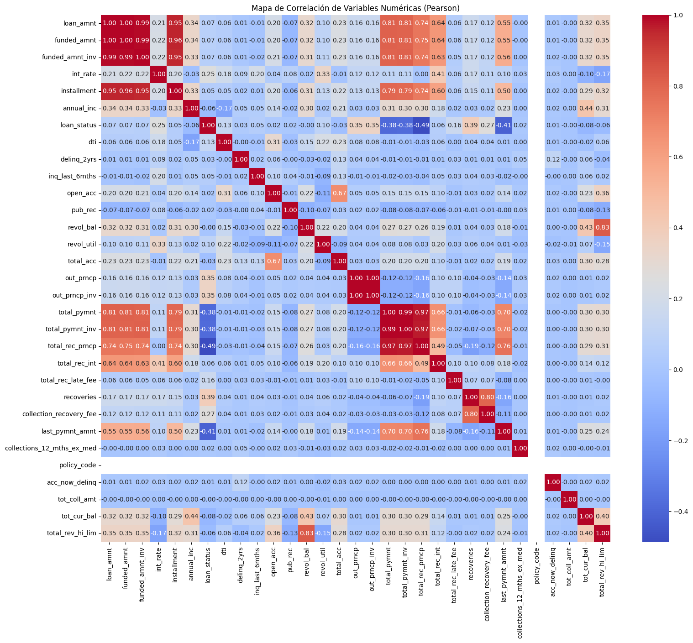
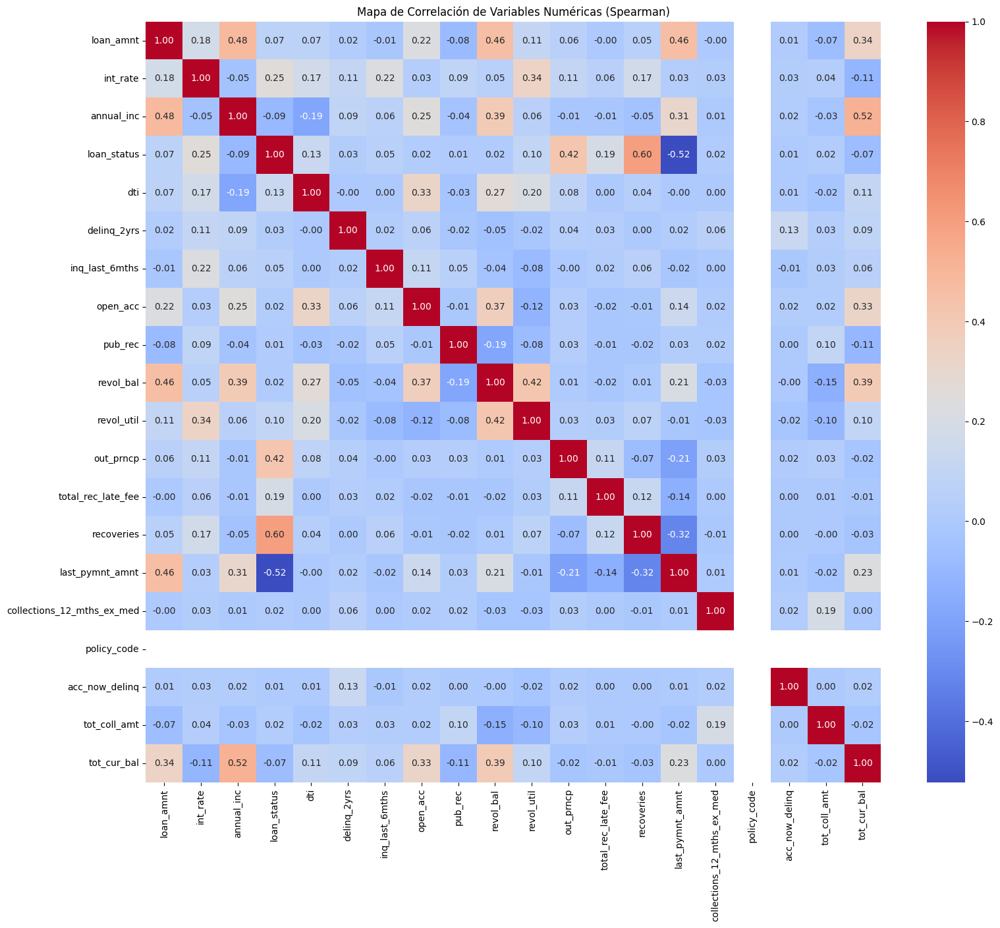
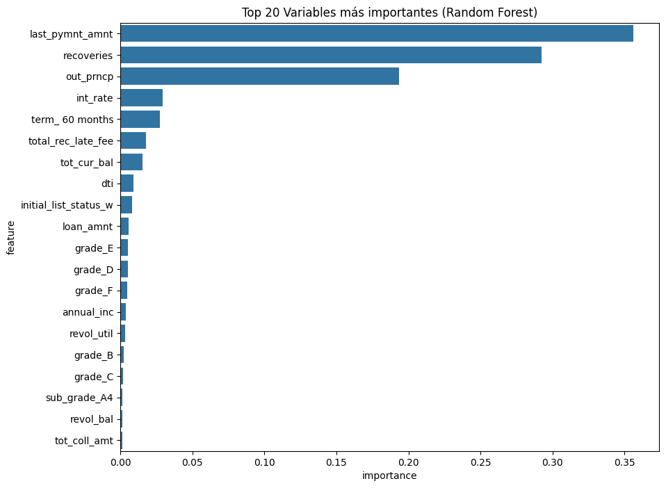
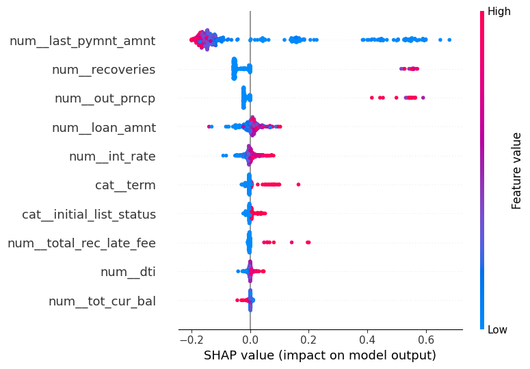
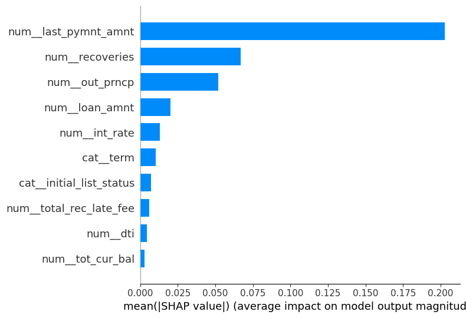

# Informe Técnico: Predicción de Incumplimiento de Crédito con Redes Neuronales Artificiales

## 1. Introducción y delimitación del problema
Este proyecto aborda un problema de clasificación binaria sobre `loan_status` para distinguir entre créditos con y sin incumplimiento. El objetivo general consiste en desarrollar y evaluar un modelo de Red Neuronal Artificial (RNA) capaz de estimar el riesgo de incumplimiento y compararlo con una línea base clásica.

Aunque el problema suele formularse como apoyo al otorgamiento de crédito, el conjunto final de variables incorpora atributos como `last_pymnt_amnt`, `recoveries`, `out_prncp` y `total_rec_late_fee`, asociados al comportamiento del crédito después del desembolso. Por ello, el encuadre metodológico más consistente es el de seguimiento de cartera, monitoreo de deterioro o cobranza temprana, no el de originación pura.

Desde la perspectiva de aprendizaje supervisado, la tarea sigue siendo una clasificación binaria en la que la clase `1` representa incumplimiento y la clase `0` no incumplimiento. Desde la perspectiva de negocio, el valor del modelo radica en detectar con oportunidad créditos problemáticos dentro de una cartera ya observada, con el fin de fortalecer decisiones de monitoreo, alertamiento y gestión de riesgo.

Esta delimitación es clave para interpretar los resultados y para no sobrestimar su alcance. Dado que el feature set incorpora señales del ciclo de vida del crédito posteriores al desembolso, el desempeño observado no debe leerse como evidencia de un score de aprobación inicial, sino como evidencia de utilidad en un problema de seguimiento de cartera. En ese escenario, la sensibilidad sobre la clase de incumplimiento adquiere un peso importante, aun cuando ello implique asumir un mayor número de falsos positivos.

## 2. Análisis descriptivo de datos
El análisis exploratorio parte del dataset `Credit Risk Dataset`. Tras la recodificación de `loan_status` y la depuración inicial, se trabaja con un dataframe de `268530` filas y `74` columnas.

La distribución de la variable objetivo es la siguiente:
- `209711` observaciones en clase `0`
- `58819` observaciones en clase `1`
- tasa aproximada de incumplimiento de `21.9%`

Posteriormente, el conjunto empleado en modelamiento queda en `190394` filas y `33` columnas, con la siguiente distribución:
- `146535` casos en clase `0`
- `43859` casos en clase `1`
- tasa de incumplimiento de `0.23036`

Esta composición sugiere un desbalance moderado de clases, lo que justifica el uso de estrategias específicas para evitar que el modelo favorezca en exceso a la clase mayoritaria.

En el proceso de limpieza se identifican `22` columnas con más de 10% de valores faltantes. Entre ellas destacan `mths_since_last_delinq`, `mths_since_last_major_derog`, `mths_since_last_record` y varias variables de crédito rotativo o información conjunta como `open_il_6m`, `open_il_12m`, `open_il_24m`, `open_rv_12m`, `open_rv_24m`, `total_bal_il`, `all_util`, `annual_inc_joint`, `verification_status_joint` y `dti_joint`.

Además, se excluyen variables altamente correlacionadas, entre ellas:
- `total_rev_hi_lim`
- `total_acc`
- `collection_recovery_fee`
- `total_rec_int`
- `out_prncp_inv`
- `funded_amnt`
- `total_pymnt_inv`
- `installment`
- `funded_amnt_inv`
- `total_rec_prncp`
- `total_pymnt`

También se eliminan variables de varianza cercana a cero:
- `collections_12_mths_ex_med`
- `policy_code`
- `acc_now_delinq`

En conjunto, estas decisiones muestran un pipeline orientado a reducir ruido, multicolinealidad y variables con baja capacidad informativa antes del entrenamiento.

### 2.1 Figuras EDA
- Mapa de correlación de variables numéricas (Pearson).

- Mapa de correlación de variables numéricas (Spearman).

- Top 20 variables más importantes del análisis exploratorio.

## 3. Metodología de modelamiento
La estrategia de modelamiento compara una Red Neuronal Artificial (RNA) con una línea base de Regresión Logística.

### 3.1 Momento de predicción y conjunto final
El modelo utiliza `loan_status` como variable objetivo y un conjunto final de 10 variables:
- `last_pymnt_amnt`
- `recoveries`
- `out_prncp`
- `int_rate`
- `term`
- `total_rec_late_fee`
- `tot_cur_bal`
- `dti`
- `initial_list_status`
- `loan_amnt`

La composición de este feature set confirma que el modelo se apoya en información post-desembolso. En consecuencia, el momento de predicción corresponde a seguimiento de cartera y/o cobranza temprana. Esta precisión evita interpretar el sistema como un score de originación cuando varias de sus variables no estarían disponibles en esa etapa.

Metodológicamente, esta decisión implica una limitación explícita: parte del poder predictivo proviene de variables observables después de iniciado el crédito. Por tanto, el modelo debe entenderse como un sistema de monitoreo de deterioro y priorización operativa dentro de una cartera en curso, no como un instrumento de admisión crediticia ex ante.

### 3.2 Preprocesamiento
El pipeline de preparación de datos incluye:
- imputación por mediana para variables numéricas mediante `SimpleImputer(strategy='median')`
- escalamiento con `StandardScaler`
- transformación mediante `ColumnTransformer`
- partición estratificada con `train_test_split`
- ponderación de clases con `compute_class_weight(class_weight='balanced')`

La estrategia principal para tratar el desbalance es, por tanto, la ponderación de clases.

### 3.3 Arquitectura de la RNA
La RNA se implementa con `tf.keras.Sequential` y contempla:
- capa de entrada con dimensionalidad igual al número de variables transformadas
- bloques densos
- opción de `BatchNormalization`
- `Dropout`
- capa final sigmoide para clasificación binaria

Las métricas internas de entrenamiento incluyen:
- `AUC(name='roc_auc', curve='ROC')`
- `AUC(name='pr_auc', curve='PR')`
- precisión
- recall

La búsqueda aleatoria de hiperparámetros identifica la siguiente configuración como la mejor:
- `units = 384`
- `regularization_type = 'l1'`
- `regularization_strength = 1e-05`
- `num_layers = 3`
- `learning_rate = 0.002`
- `layer_shrink_factor = 0.6`
- `label_smoothing = 0.03`
- `gaussian_noise_std = 0.0`
- `epsilon = 1e-07`
- `dropout = 0.5`
- `clipnorm = 2.0`
- `beta_2 = 0.99`
- `beta_1 = 0.95`
- `batch_size = 512`
- `batch_norm = True`

El umbral de decisión no se fija en `0.5`, sino que se ajusta en validación maximizando F2. El valor seleccionado es `0.54933`, lo que refuerza una política de detección sensible sobre la clase de incumplimiento.

### 3.4 Baseline
La línea base corresponde a una `LogisticRegression`. Su inclusión permite contrastar el comportamiento de la RNA frente a un modelo clásico, interpretable y ampliamente utilizado en problemas de clasificación binaria.

## 4. Evaluación comparativa de desempeño
La comparación entre modelos se resume en la siguiente tabla:

| Modelo | Validation PR-AUC | Test PR-AUC | Validation ROC-AUC | Test ROC-AUC | Accuracy | F1 clase 1 |
|---|---:|---:|---:|---:|---:|---:|
| RNA | 0.98030 | 0.98266 | No recuperado en salidas visibles | No recuperado en salidas visibles | 0.9519 | 0.9040 |
| Regresión Logística | 0.95537 | 0.96029 | No recuperado en salidas visibles | No recuperado en salidas visibles | 0.9323 | 0.8677 |

### 4.1 Resultados de la RNA
- Clase `0`: precisión `0.9945`, recall `0.9427`, F1 `0.9679`, soporte `29307`
- Clase `1`: precisión `0.8370`, recall `0.9827`, F1 `0.9040`, soporte `8772`
- Accuracy global: `0.9519`
- Macro F1: `0.9360`
- Weighted F1: `0.9532`

### 4.2 Resultados de la Regresión Logística
- Clase `0`: precisión `0.9883`, recall `0.9230`, F1 `0.9545`, soporte `29307`
- Clase `1`: precisión `0.7893`, recall `0.9634`, F1 `0.8677`, soporte `8772`
- Accuracy global: `0.9323`
- Macro F1: `0.9111`
- Weighted F1: `0.9345`

### 4.3 Interpretación técnica
La comparación muestra que la RNA supera a la Regresión Logística en las métricas reportadas:
- mayor PR-AUC en validación y prueba
- mejor accuracy global (`0.9519` vs `0.9323`)
- mayor recall para la clase de incumplimiento (`0.9827` vs `0.9634`)
- mayor precisión positiva (`0.8370` vs `0.7893`)

En un contexto de seguimiento de cartera, la combinación de PR-AUC alta y recall elevado sobre la clase `1` resulta especialmente valiosa, ya que privilegia la detección de casos riesgosos. El uso de un umbral optimizado con F2 es coherente con esta prioridad.

No obstante, el alcance contractual exigía incluir `ROC-AUC`. En esta iteración no se incorpora una cifra numérica porque las salidas visibles del notebook permiten verificar `PR-AUC`, accuracy, precisión, recall y F1, pero no muestran el valor final consolidado de `ROC-AUC` para validación y prueba. Esta ausencia debe leerse como una brecha documental del entregable y no como una sustitución conceptual por `PR-AUC`.

### 4.4 Figuras de evaluación
En esta versión del informe se omiten deliberadamente las curvas Precision-Recall y las matrices de confusión para priorizar la entrega del contenido técnico principal dentro del tiempo disponible. La evaluación cuantitativa permanece sustentada en la tabla comparativa de métricas y en los reportes de clasificación ya consignados.

## 5. Análisis de riesgo e interpretabilidad
La interpretabilidad se presenta en dos niveles claramente diferenciados: una capa exploratoria, derivada del análisis descriptivo, y una capa específica del modelo neuronal, basada en SHAP. Ambas aportan valor, pero no son equivalentes ni deben fusionarse como si provinieran del mismo procedimiento.

### 5.1 Importancia exploratoria de variables
El análisis exploratorio reporta el siguiente top de variables influyentes:
- `last_pymnt_amnt`: `0.356140`
- `recoveries`: `0.292410`
- `out_prncp`: `0.193586`
- `int_rate`: `0.029527`
- `term_ 60 months`: `0.027584`
- `total_rec_late_fee`: `0.017887`
- `tot_cur_bal`: `0.015299`
- `dti`: `0.009023`
- `initial_list_status_w`: `0.008162`
- `loan_amnt`: `0.005557`

Este ranking debe entenderse como una referencia exploratoria del comportamiento del conjunto de datos obtenida en la etapa de EDA. No constituye por sí mismo una explicación formal de la RNA final, sino una señal preliminar sobre qué variables parecen concentrar poder discriminante en el dataset trabajado.

### 5.2 Interpretabilidad de la RNA mediante SHAP
La mejor RNA fue sometida a análisis de interpretabilidad con SHAP, incluyendo:
- resumen global
- gráfico de barras de importancia

En las evidencias visibles del notebook se observa la ejecución de `DeepExplainer` y la generación de `summary_plot` y `bar plot`, lo que confirma que existe interpretabilidad específica sobre la RNA. Sin embargo, no se visualiza un ranking textual numérico consolidado de SHAP dentro de las salidas inspeccionadas. Por ello, la interpretación de la RNA debe apoyarse en las figuras SHAP del documento final y no en los pesos numéricos del EDA.

### 5.3 Lectura de negocio
Tomando por separado la evidencia exploratoria y la evidencia específica del modelo, los hallazgos apuntan a tres bloques de riesgo:
- comportamiento de pago reciente: `last_pymnt_amnt`, `recoveries`, `total_rec_late_fee`
- exposición financiera remanente: `out_prncp`, `tot_cur_bal`, `loan_amnt`
- severidad estructural del crédito: `int_rate`, `term`, `dti`

En lenguaje de negocio, esto sugiere que el deterioro crediticio se relaciona con señales de pago reciente, nivel de recuperación, saldo pendiente y carga financiera. Esta lectura es plenamente coherente con un modelo de monitoreo o cobranza temprana. La conclusión sustantiva es robusta en ambos niveles de evidencia, pero la trazabilidad técnica debe mantenerse separada: el ranking numérico proviene del EDA y la atribución local/global sobre la RNA proviene de SHAP.

### 5.4 Figuras de interpretabilidad
- SHAP summary plot de la mejor RNA.

- SHAP bar plot de la mejor RNA.

## 6. Scorecard y aplicación web
### 6.1 Scorecard
La aplicación implementa una conversión directa de la probabilidad de incumplimiento a un score crediticio en escala de `300` a `850`, definido de forma inversamente proporcional a la probabilidad estimada por el modelo. La expresión utilizada es:
$$
\text{score} = \operatorname{round}(850 - p_{\text{incumplimiento}} \times 550)
$$

Bajo esta lógica, una mayor `defaultProbability` produce un menor puntaje crediticio, mientras que una menor probabilidad de incumplimiento produce un score más alto. Se trata de una regla de transformación lineal simple, útil para visualización y consumo en la aplicación web.

### 6.2 Repositorio y despliegue
- Repositorio: `https://github.com/d0ubt0/credit-risk`
- Aplicación web: `https://credit-risk-neuronal-network.netlify.app/#`

### 6.3 Figura de aplicación web
- Captura de pantalla de la aplicación web o del repositorio.

## 7. Aprendizajes, conclusiones y limitaciones
El proyecto presenta una metodología consistente de limpieza, selección de variables, comparación contra una línea base clásica y optimización de una RNA. Los resultados muestran que la RNA supera a la Regresión Logística en PR-AUC, accuracy, precisión positiva y recall de la clase de incumplimiento.

La conclusión principal es que la RNA constituye una alternativa técnicamente superior al baseline clásico para tareas de monitoreo de riesgo crediticio post-desembolso. Su desempeño la hace especialmente útil cuando se prioriza la detección de casos riesgosos dentro de la cartera.

Los principales aprendizajes son:
- la depuración del dataset fue determinante para reducir ruido y redundancia
- el ajuste del umbral por F2 desplaza la decisión hacia mayor sensibilidad sobre la clase riesgosa
- las variables más influyentes se concentran en pagos recientes, recuperaciones, saldo remanente y costo financiero

Las principales limitaciones son:
- el feature set final no corresponde a un escenario de originación pura
- el documento no recupera las cifras finales de `ROC-AUC` en las salidas visibles revisadas, por lo que la comparación con esa métrica queda formalmente incompleta
- la sección de scorecard permanece como desarrollo futuro
- las figuras de interpretabilidad y evaluación deben incorporarse en la versión maquetada final

## 8. Referencias
- Kaggle. (s. f.). *Credit Risk Dataset*. Recuperado el 21 de abril de 2026, de https://www.kaggle.com/datasets/laotse/credit-risk-dataset
- Lundberg, S. M., & Lee, S.-I. (2017). *A unified approach to interpreting model predictions*. En I. Guyon et al. (Eds.), *Advances in Neural Information Processing Systems 30 (NeurIPS 2017)*. https://proceedings.neurips.cc/paper_files/paper/2017/file/8a20a8621978632d76c43dfd28b67767-Paper.pdf
- scikit-learn developers. (s. f.). *scikit-learn: Machine learning in Python*. Recuperado el 21 de abril de 2026, de https://scikit-learn.org/
- TensorFlow Developers. (s. f.). *TensorFlow Keras*. Recuperado el 21 de abril de 2026, de https://www.tensorflow.org/api_docs/python/tf/keras
- d0ubt0. (s. f.). *credit-risk* [Repositorio de GitHub]. GitHub. Recuperado el 21 de abril de 2026, de https://github.com/d0ubt0/credit-risk
- d0ubt0. (s. f.). *credit-risk-neuronal-network* [Aplicación web]. Netlify. Recuperado el 21 de abril de 2026, de https://credit-risk-neuronal-network.netlify.app/
